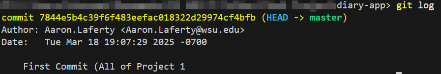

# ThoughtStream - Diary App

## Project part 1

## Project Overview

**ThoughtStream** is a web-based diary application that allows users to create, store, and reflect on their daily thoughts. The app supports filtering entries based on tags, location, and keywords. With an easy-to-use interface, users can capture their reflections, track personal growth, and revisit memories with ease.

The backend of ThoughtStream is powered by **Node.js**, **Express.js**, **MongoDB**, and **Mongoose**, while the frontend uses **React.js**. This app is designed to help users manage their personal reflections securely and conveniently.

## Setup Instructions

To run the backend of the ThoughtStream application locally, follow the steps below:

### 1. Install Dependencies

Make sure you have Node.js installed. If not, you can download it from [here](https://nodejs.org/)

Install the required npm dependencies
```bash
npm install mongoose express dotenv cors axios
```

You can also install ```nodemon``` as well with the following command
```bash
npm install nodemon --save-dev
```

### 3. Configure Environment Variables

Use the template ```.env``` file in the root of the project and insert the necessary requirements.

```MONGO_URI:``` The URI String for your own MongoDBAtlas or local DB
```PORT:``` The Port going to be used for the web server
```WEATHER KEY:``` The API Key for OpenWeatherMap you will be using

### 4. Start the Server

Run the development server with the following command:

```bash
npm run dev
```
This will be ran with nodemon as well

For production testing, do:

```bash
npm start
```

## API Usage Guide

### 1. Creating a New Diarty Entry

* Route: ```POST /api/diary```
* Description: Creates a new diary entry.
* Request Body: 
```json
{
  "title": "Morning Reflections",
  "content": "Today was a great day! Had a nice cup of coffee.",
  "reflection": "Feeling grateful for the little moments.",
  "location": "Seattle, US",
  "tags": ["morning", "coffee"],
  "weather": {
    "condition": "Sunny",
    "temperature": 72,
    "location": "Seattle"
  }
}
```
* Response (Success):
```json
{
  "_id": "609d3a48f2fb8a16d47c9f9a",
  "title": "Morning Reflections",
  "content": "Today was a great day! Had a nice cup of coffee.",
  "reflection": "Feeling grateful for the little moments.",
  "location": "Seattle, US",
  "tags": ["morning", "coffee"],
  "weather": {
    "condition": "Sunny",
    "temperature": 72,
    "location": "Seattle"
  },
  "createdAt": "2025-03-18T12:00:00.000Z",
  "updatedAt": "2025-03-18T12:00:00.000Z"
}
```

* Response (Error - Missing Fields):
```json
{
  "message": "Title, content, and location are required"
}
```

* Response (Error Backend/DB):
```json
{
  "message": "Operation Failed"
}
```

### 2. Get All Diary Entries

* Route: ```GET /api/diary```
* Description: Retrieves all diary entries

* Response (Success):
```json
{
  "_id": "609d3a48f2fb8a16d47c9f9a",
  "title": "Morning Reflections",
  "content": "Today was a great day! Had a nice cup of coffee.",
  "reflection": "Feeling grateful for the little moments.",
  "location": "Seattle, US",
  "tags": ["morning", "coffee"],
  "weather": {
    "condition": "Sunny",
    "temperature": 72,
    "location": "Seattle"
  },
  "createdAt": "2025-03-18T12:00:00.000Z",
  "updatedAt": "2025-03-18T12:00:00.000Z"
}
```

* Response (Error Backend/DB):
```json
{
  "message": "Operation Failed"
}
```

### 3. Get a Specific Diary Entry by ID

* Route: ```GET /api/diary/:id```
* Description: Retrieves a single diary entry by its unique ID.
* Request Body: 

* Response (Success):
```json
{
  "_id": "609d3a48f2fb8a16d47c9f9a",
  "title": "Morning Reflections",
  "content": "Today was a great day! Had a nice cup of coffee.",
  "reflection": "Feeling grateful for the little moments.",
  "location": "Seattle, US",
  "tags": ["morning", "coffee"],
  "weather": {
    "condition": "Sunny",
    "temperature": 72,
    "location": "Seattle"
  },
  "createdAt": "2025-03-18T12:00:00.000Z",
  "updatedAt": "2025-03-18T12:00:00.000Z"
}
```

* Response (Error - No Entry Found):
```json
{
  "message": "No Entry Found"
}
```

* Response (Error Backend/DB):
```json
{
  "message": "Operation Failed"
}
```

### 4. Filter Diary Entries with Queries

* Route: ```GET /api/diary```
* Description: Creates a new diary entry.
* Examples:
* 1. Fetch All Entries (No Filters): ```GET /API/diary```
* 2. Search By Keyword: ```GET /API/diary?search=coffee```
* 3. Filter By Tag: ```GET /API/diary?tag=morning```
* 4. Filter By Location: ```GET /API/diary?location=Seattle```
* 5. Combine Multiple Filters: ```GET /API/diary?tag=morning&search=coffee```


* Response (Success):
```json
{
  "_id": "609d3a48f2fb8a16d47c9f9a",
  "title": "Morning Reflections",
  "content": "Today was a great day! Had a nice cup of coffee.",
  "reflection": "Feeling grateful for the little moments.",
  "location": "Seattle, US",
  "tags": ["morning", "coffee"],
  "weather": {
    "condition": "Sunny",
    "temperature": 72,
    "location": "Seattle"
  },
  "createdAt": "2025-03-18T12:00:00.000Z",
  "updatedAt": "2025-03-18T12:00:00.000Z"
}
```

* Response (Error Backend/DB):
```json
{
  "message": "Operation Failed"
}
```

### 5. Update A Diary Entry

* Route: ```PUT /api/diary:id```
* Description: Updates a diary entry by its unique id.
* Request Body: 
```json
{
  "title": "Updated Reflections",
  "content": "Had an amazing day, feeling great!",
  "reflection": "Learning a lot about myself.",
  "location": "Seattle, US",
  "tags": ["reflection", "self-growth"]
}
```
* Response (Success):
```json
{
  "_id": "609d3a48f2fb8a16d47c9f9a",
  "title": "Updated Reflections",
  "content": "Had an amazing day, feeling great!",
  "reflection": "Learning a lot about myself.",
  "location": "Seattle, US",
  "tags": ["reflection", "self-growth"],
  "weather": {
    "condition": "Sunny",
    "temperature": 72,
    "location": "Seattle"
  },
  "createdAt": "2025-03-18T12:00:00.000Z",
  "updatedAt": "2025-03-18T12:00:00.000Z"
}
```

* Response (No Entry Found):
```json
{
  "message": "No Entry Found"
}
```

* Response (Error Backend/DB):
```json
{
  "message": "Operation Failed"
}
```

### 6. Delete A Diary Entry

* Route: ```DELETE /api/diary:id```
* Description: Deletes a diary entry by its id

* Response (Success):
```json
{
    "message": "Entry deleted successfully"
}
```

* Response (Error Backend/DB):
```json
{
  "message": "Operation Failed"
}
```

## Technologies Used
* Backend: Node.js, Express.js, MongoDB, Mongoose

## License
This project is licensed under the MIT License - see the LICENSE file for details

## Acknowledgements
* MongoDB - Database solution used for storing diary entries.
* Express.js - Web framework for building API

## Common Issues & Debugging Tips

I noticed some issues regarding the user id requirement. I had to comment it out because we will implement oauth later.

I also noticed an issue with fetchWeather cause its not implemented. My "guess" is that this will be implemented in the future but not sure. Will update in case things change.

## API Testing Results

### Creating An Entry:


### Getting All Entries:


### Get Entry By Id:


## Get Entries By Filter


## Update Entries


## Delete Entries


## Commit History



NOTES TO GRADER: The images for creating entries are no longer up to date. We no longer require users to input weather manually. It will use OpenWeatherAPI to fetch that for us

## Project part 2

## 1. Overview

**Feature Goal for ThoughtStream Part 2:**

The goal of part 2 was to implement secure third-party authentication using Google OAuth so users can log into the Diary App with their Google Accounts. Once logged in, users should be able to access API routes that are protected and perform actions that are user-specific. These include all CRUD operations that pertain to the user ID. 

**Type of Authentication Implemented:**

We were instructed to use OAuth 2.0 with Google as a third-party provider using the ```passport-google-oatuh20``` strategy. In this method, users do not need to create a separate password for our app or username and makes logging in quicker and more simple.

**How Authentication Changes Once Front-end is Added:**

Right now, login happens via redirects and callbacks handled on the server-side. Once a front-end is integrated, the authentication flow will be adjusted to use client-side login triggers and redirection handling, most likely a more API-based token or session handshake.

**Packages and Middleware Used and Why:**

* ```passport```: Core authentication library that provides a clean way to use our strategy.
* ```passport-google-oauth20```: Strategy we used to authenticate users using Google.
* ```express-session```: Middleware to manage sessions & storing the session ID in a cookie.
* ```cookie-parser```: Used to parse cookies and read session IDs.

All previosly mentioned packages were also used, including cors, dotenv, etc.

## 2. Google Cloud Console Workflow**

**Steps to Enable Google Client ID:**

1. Go to [https://console.cloud.google.com](https://console.cloud.google.com).
2. Create new project.
3. Navigate to APIs & Services > Credentials.
4. Click Create Credentials > OAuth Client ID.
5. Choose Web Application.
6. Set authorized redirect URI.
7. Save to get Client ID and Client Secret.
8. Store in .env file in ```GOOGLE_CLIENT_ID``` & ```GOOGLE_CLIENT_SECRET```.

**What is Oauth2:**

OAuth 2.0 is a framework for authorization that allows applications to access user data from third-party services like Google, Facebook, etc without handling their login credentials directly. Instead of a username and password requirement and having to store them in a secure database, a token is exchanged which grants access to user information in a way that is much more secure and streamlined.

## 3. Authentication Flow Description
1. The user goes to the web page at the URL (e.g., ```http:localhost:{PORT}/auth/google```).
2. The server redirects the user to Google's OAuth consent screen.
3. The user logs in and consents to sharing profile information.
4. Google redirects back to the server with an authorization code.
5. The server uses the code to request an access token and retrieve the user's profile.
6. Passport either finds or creates the user in the database.
7. The session is established using ```express-session```.
8. The session ID is sent to the browser as a cookie.

## 4. Environment Variables
Environment variables used:
* ```MONGO_URI```: MongoDB connection string.
* ```PORT```: Port number the web app is hosted on.
* ```WEATHER_KEY```: The key for OpenWeatherMap API.
* ```GOOGLE_CLIENT_ID```: Google OAuth Client ID.
* ```GOOGLE_CLIENT_SECRET```: Google OAuth Client Secret.
* ```GOOGLE_CALLBACK_URL```: Google OAuth Callback URL.
* ```SESSION_SECRET```: Secret key for signing the session ID cookie.

## 5. Mongoose Models and Schema Changes
**Models Used:**

* ```User```:
```js
  {
    googleId: { type: String, required: true, unique: true },
    name: String,
    email: String,
    picture: String,
  },
{ timestamps: true }
```
* ```DiaryEntry```: 
```js
    user: { type: mongoose.Schema.Types.ObjectId, ref: "User", required: true },
    title: { type: String, required: true },
    content: { type: String, required: true },
    reflection: { type: String, trim: true, maxlength: 500 },
    location: { type: String, required: true },
    tags: { type: [String], default: [] },
    weather: {
      condition: { type: String },
      temperature: { type: Number },
      location: { type: String },
    },
  { timestamps: true }
```

**How Documents Reference Each Other:** Each DiaryEntry includes a user field which stores the MongoDB ObjectId of the ```User``` that created the entry. This will create a reference relationship and allow for population queries to retrieve user-specific entries for CRUD operations.

## 6. Route Protection
**What ```ensureAuthenticated``` Does:** ```ensureAuthenticated``` is a middleware function that checks if ```req.isAuthenticated()``` returns true. If the user is not logged in, it sends a 401 Unauthorized response. If the user is authenticated, it proceeds with the request.

**How it's Used in Routes:**

```js
router.get('/api/diary', ensureAuthenticated, (req, res) => {
  //return user's diary entries
});
```

This ensures only logged-in users can access this protected operation and data that it might respond with.

## 7. Logout Route

**Route Used:** ```GET /auth/logout```

**What Happens:**

1. The ```req.logout()``` function is called to remove the user from the session.
2. The session is destroyed using ```req.session.destroy()```.
3. The response clears the cookie and sends a confirmation message.
4. If at any point login fails, a 500 internal server error back to the user.

**Example:**

```js
router.get("/logout", (req, res) => {
    req.logout(function(err) {
        if (err) {
            // Failed to log out
            return res.status(500).send("Logout failed. Please try again.");
        }

        req.session.destroy((sessionErr)=> {
            if (sessionErr) {
                // Failed to destroy session
                return res.status(500).send("Logout failed: Could not end session.")
            }

            res.clearCookie("connect.sid");
            res.status(200).send("You have been logged out successfully");
        });
    });
});
```

## 8. Testing Strategies (Postman)

**Step-by-Step:**
1. **Login by Browser:**
* Visit local port in the browser where server is running.
* Sign in with your Google account.
* You will be redirected back to the app with an active session and a message displayed.

2. **Get ```connect.sid``` Cookie:***
* Open browser Developer Tools.
* Go to the Application tab.
* Under **Storage > Cookies**, Select your localhost domain.
* Copy the value of ```connect.sid```.

3. **Add Cookie in Postman:**
In your Postman request to a protected route:
* Go to the **Headers** tab.
* Set the key as ```Cookie```.
* Set the value as ```connect.sid={your_sid_here}```

4. **Example Request to Protected Route:**
```GET http://localhost:{PORT}/api/diary```
```Headers:```
```Cookie: connect.sid={connect.sidFromDevTools}```

5. **What Happens When Cookie is Missing:**
The request is rejected. The server will return a 401 Unauthorized error because ```req.isAuthenticated()``` returns false without a valid session.

## 9. Known Issues or Future Improvements

**Known Issues:**
* Manually copying the ```connect.sid``` cookies into Postman got really annoying for testing. I also had to keep track of multiple current session cookies with different accounts to make sure they could not access each other's entries.
* Errors like ```redirect_uri_mismatch``` occurred once cause I forgot to change the port number to the current port I hosted it on. This was fixed though. This is just cause the Google Console did not match the redirect URI we had hooked up in our server.
* Did receive bad requests errors from not defining users in the diary Model (It was previously commented out as it wasn't being used)

**Future Improvements:**
* Include front-end framework for better integration with client-side front-end.
* Implement more robust error-handling for OAuth and API request errors
* Create proper login/logout buttons for starting OAuth process.
