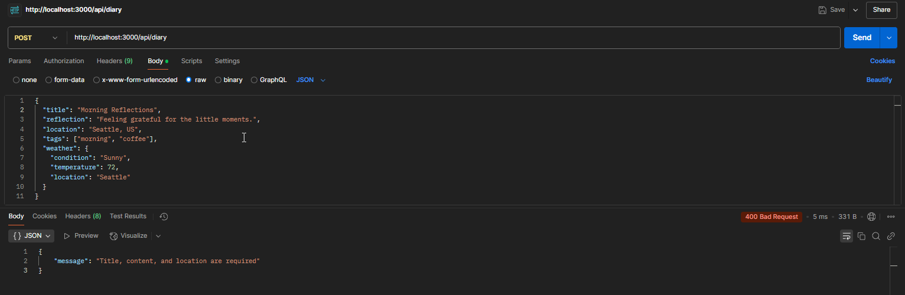

# ThoughtStream - Diary App

## Project Overview

**ThoughtStream** is a web-based diary application that allows users to create, store, and reflect on their daily thoughts. The app supports filtering entries based on tags, location, and keywords. With an easy-to-use interface, users can capture their reflections, track personal growth, and revisit memories with ease.

The backend of ThoughtStream is powered by **Node.js**, **Express.js**, **MongoDB**, and **Mongoose**, while the frontend uses **React.js**. This app is designed to help users manage their personal reflections securely and conveniently.

## Setup Instructions

To run the backend of the ThoughtStream application locally, follow the steps below:

### 1. Install Dependencies

Make sure you have Node.js installed. If not, you can download it from [here](https://nodejs.org/)

Install the required npm dependencies
```bash
npm install mongoose express dotenv cors axios
```

You can also install ```nodemon``` as well with the following command
```bash
npm install nodemon --save-dev
```

### 3. Configure Environment Variables

Use the template ```.env``` file in the root of the project and insert the necessary requirements.

```MONGO_URI:``` The URI String for your own MongoDBAtlas or local DB
```PORT:``` The Port going to be used for the web server

### 4. Start the Server

Run the development server with the following command:

```bash
npm run dev
```
This will be ran with nodemon as well

For production testing, do:

```bash
npm start
```

## API Usage Guide

### 1. Creating a New Diarty Entry

* Route: ```POST /api/diary```
* Description: Creates a new diary entry.
* Request Body: 
```json
{
  "title": "Morning Reflections",
  "content": "Today was a great day! Had a nice cup of coffee.",
  "reflection": "Feeling grateful for the little moments.",
  "location": "Seattle, US",
  "tags": ["morning", "coffee"],
  "weather": {
    "condition": "Sunny",
    "temperature": 72,
    "location": "Seattle"
  }
}
```
* Response (Success):
```json
{
  "_id": "609d3a48f2fb8a16d47c9f9a",
  "title": "Morning Reflections",
  "content": "Today was a great day! Had a nice cup of coffee.",
  "reflection": "Feeling grateful for the little moments.",
  "location": "Seattle, US",
  "tags": ["morning", "coffee"],
  "weather": {
    "condition": "Sunny",
    "temperature": 72,
    "location": "Seattle"
  },
  "createdAt": "2025-03-18T12:00:00.000Z",
  "updatedAt": "2025-03-18T12:00:00.000Z"
}
```

* Response (Error - Missing Fields):
```json
{
  "message": "Title, content, and location are required"
}
```

* Response (Error Backend/DB):
```json
{
  "message": "Operation Failed"
}
```

### 2. Get All Diary Entries

* Route: ```GET /api/diary```
* Description: Retrieves all diary entries

* Response (Success):
```json
{
  "_id": "609d3a48f2fb8a16d47c9f9a",
  "title": "Morning Reflections",
  "content": "Today was a great day! Had a nice cup of coffee.",
  "reflection": "Feeling grateful for the little moments.",
  "location": "Seattle, US",
  "tags": ["morning", "coffee"],
  "weather": {
    "condition": "Sunny",
    "temperature": 72,
    "location": "Seattle"
  },
  "createdAt": "2025-03-18T12:00:00.000Z",
  "updatedAt": "2025-03-18T12:00:00.000Z"
}
```

* Response (Error Backend/DB):
```json
{
  "message": "Operation Failed"
}
```

### 3. Get a Specific Diary Entry by ID

* Route: ```GET /api/diary/:id```
* Description: Retrieves a single diary entry by its unique ID.
* Request Body: 

* Response (Success):
```json
{
  "_id": "609d3a48f2fb8a16d47c9f9a",
  "title": "Morning Reflections",
  "content": "Today was a great day! Had a nice cup of coffee.",
  "reflection": "Feeling grateful for the little moments.",
  "location": "Seattle, US",
  "tags": ["morning", "coffee"],
  "weather": {
    "condition": "Sunny",
    "temperature": 72,
    "location": "Seattle"
  },
  "createdAt": "2025-03-18T12:00:00.000Z",
  "updatedAt": "2025-03-18T12:00:00.000Z"
}
```

* Response (Error - No Entry Found):
```json
{
  "message": "No Entry Found"
}
```

* Response (Error Backend/DB):
```json
{
  "message": "Operation Failed"
}
```

### 4. Filter Diary Entries with Queries

* Route: ```GET /api/diary```
* Description: Creates a new diary entry.
* Examples:
* 1. Fetch All Entries (No Filters): ```GET /API/diary```
* 2. Search By Keyword: ```GET /API/diary?search=coffee```
* 3. Filter By Tag: ```GET /API/diary?tag=morning```
* 4. Filter By Location: ```GET /API/diary?location=Seattle```
* 5. Combine Multiple Filters: ```GET /API/diary?tag=morning&search=coffee```


* Response (Success):
```json
{
  "_id": "609d3a48f2fb8a16d47c9f9a",
  "title": "Morning Reflections",
  "content": "Today was a great day! Had a nice cup of coffee.",
  "reflection": "Feeling grateful for the little moments.",
  "location": "Seattle, US",
  "tags": ["morning", "coffee"],
  "weather": {
    "condition": "Sunny",
    "temperature": 72,
    "location": "Seattle"
  },
  "createdAt": "2025-03-18T12:00:00.000Z",
  "updatedAt": "2025-03-18T12:00:00.000Z"
}
```

* Response (Error Backend/DB):
```json
{
  "message": "Operation Failed"
}
```

### 5. Update A Diary Entry

* Route: ```PUT /api/diary:id```
* Description: Updates a diary entry by its unique id.
* Request Body: 
```json
{
  "title": "Updated Reflections",
  "content": "Had an amazing day, feeling great!",
  "reflection": "Learning a lot about myself.",
  "location": "Seattle, US",
  "tags": ["reflection", "self-growth"]
}
```
* Response (Success):
```json
{
  "_id": "609d3a48f2fb8a16d47c9f9a",
  "title": "Updated Reflections",
  "content": "Had an amazing day, feeling great!",
  "reflection": "Learning a lot about myself.",
  "location": "Seattle, US",
  "tags": ["reflection", "self-growth"],
  "weather": {
    "condition": "Sunny",
    "temperature": 72,
    "location": "Seattle"
  },
  "createdAt": "2025-03-18T12:00:00.000Z",
  "updatedAt": "2025-03-18T12:00:00.000Z"
}
```

* Response (No Entry Found):
```json
{
  "message": "No Entry Found"
}
```

* Response (Error Backend/DB):
```json
{
  "message": "Operation Failed"
}
```

### 6. Delete A Diary Entry

* Route: ```DELETE /api/diary:id```
* Description: Deletes a diary entry by its id

* Response (Success):
```json
{
    "message": "Entry deleted successfully"
}
```

* Response (Error Backend/DB):
```json
{
  "message": "Operation Failed"
}
```

## Technologies Used
* Backend: Node.js, Express.js, MongoDB, Mongoose

## License
This project is licensed under the MIT License - see the LICENSE file for details

## Acknowledgements
* MongoDB - Database solution used for storing diary entries.
* Express.js - Web framework for building API

## Common Issues & Debugging Tips

I noticed some issues regarding the user id requirement. I had to comment it out because we will implement oauth later.

I also noticed an issue with fetchWeather cause its not implemented. My "guess" is that this will be implemented in the future but not sure. Will update in case things change.

## API Testing Results

### Creating An Entry:




### Getting All Entries:


### Get Entry By Id:


## Get Entries By Filter


## Update Entries


## Delete Entries


